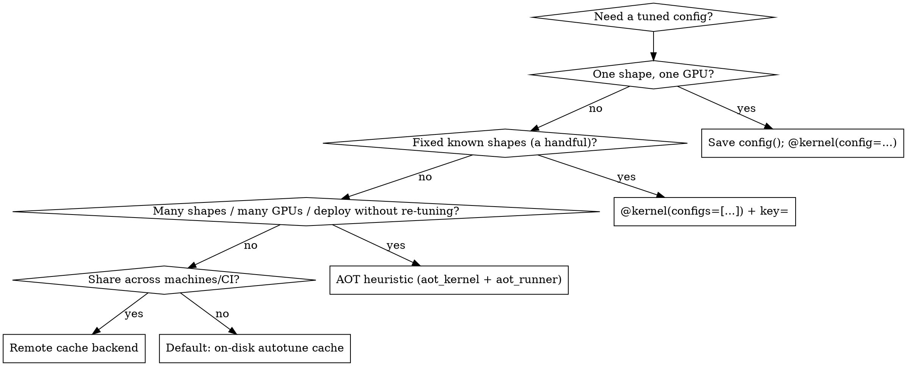

# Helion: Jagged Tensors & Autotuning/Config Management

## Overview

Two high-value Helion areas that are easy to get wrong or miss entirely:

1. **Ragged/jagged tensors** — `hl.jagged_tile()` iterates variable-length inner
   dimensions with *implicit* masking, so you never hand-build masks.
2. **Autotuning & config management** — autotuning is slow; Helion has a layered
   system (on-disk cache → saved configs → AOT heuristics) for tuning once and
   reusing results keyed by **GPU architecture and input shape**.

The single most-missed feature: **AOT heuristics** (`helion.experimental.aot_kernel`
+ `python -m helion.experimental.aot_runner`) give zero-cost per-shape config
selection at runtime, with automatic compute-capability fallback. If a request
mentions "many GPUs," "many shapes," or "don't want to re-tune at deploy," reach
for AOT, not just the cache.

---

## Part 1 — Ragged / Jagged Tensors

### Data layout

Jagged data is stored **prefix-packed**: a flat `x_data` buffer holding all rows
concatenated, plus an `x_offsets` tensor of length `num_rows + 1` where row `i` is
`x_data[x_offsets[i] : x_offsets[i+1]]`. Per-row length = `ends - starts`.

### `hl.jagged_tile(parent)` — the core API

`hl.jagged_tile(parent)` is the jagged counterpart to `hl.tile()`. `parent` is an
N-D tensor of **per-lane end positions** drawn from an enclosing tile context. It
lowers to a dense `hl.tile(parent.amax())` loop but **masks out indices where
`tile_k.index >= parent[lane]` automatically** — you write the ragged loop directly.

```python
import torch
import helion
import helion.language as hl


@helion.kernel()
def jagged_sum(x_data: torch.Tensor, x_offsets: torch.Tensor) -> torch.Tensor:
    b = x_offsets.size(0) - 1
    out = torch.zeros([b], dtype=x_data.dtype, device=x_data.device)

    for tile_b in hl.tile(b):
        starts = x_offsets[tile_b]
        ends = x_offsets[tile_b.index + 1]   # note: tile_b.index + 1 for the upper offset
        lengths = ends - starts

        acc = hl.zeros([tile_b], dtype=x_data.dtype)
        for tile_k in hl.jagged_tile(lengths):       # implicit masking, no manual mask
            idx = starts[:, None] + tile_k.index[None, :]
            acc = acc + x_data[idx].sum(dim=1)
        out[tile_b] = acc
    return out
```

### Rules & gotchas for `jagged_tile`

- `parent` must be **rank ≥ 1** (no scalars); every axis must come from an
  enclosing tile context. The 1-D "per-row length" case is the common one.
- It **cannot be the outermost loop** of a kernel — it needs a parent tile.
- A jagged child tile **must be indexed with its parent axes**: `x[tile_b, tile_k]`
  is valid, `x[tile_k]` alone is not.
- Nest `jagged_tile` for multi-level ragged iteration (e.g. variable rows × variable
  features). See `jagged_mean.py`.
- Use plain `hl.tile()` (not jagged) when the inner bound is uniform across lanes.
- The manual equivalent (when you need it): `for tile_k in hl.tile(lengths.amax())`
  with `extra_mask=tile_k.index[None, :] < lengths[:, None]` passed to `hl.load`.

### Reference examples (in the Helion repo `examples/`)

| File | Pattern |
|------|---------|
| `jagged_sum.py` | basic per-row reduction |
| `jagged_mean.py` | nested `jagged_tile` (rows × features) |
| `jagged_softmax.py` | online/Welford reduction over ragged dim |
| `jagged_layer_norm.py` | per-row normalization |
| `jagged_dense_add.py` | ragged + dense, manual `extra_mask` style |
| `jagged_dense_bmm.py`, `jagged_hstu_attn.py` | jagged matmul / attention |

---

## Part 2 — Autotuning & Config Management

### Pick the right mechanism



### Tune once, save, reload

`Kernel.autotune(args)` returns the best `helion.Config`. `Config` is JSON-serializable.

```python
config = my_kernel.autotune(example_inputs)   # returns helion.Config
config.save("configs/my_kernel.json")          # atomic write

best = helion.Config.load("configs/my_kernel.json")
@helion.kernel(config=best)        # one config, applied to ALL shapes/dtypes/devices
def my_kernel(x, y): ...
```

Other `Config` methods: `.to_json()` / `.from_json(str)`, `.from_dict(d)`,
`.minimize(config_spec)` (drop default-valued keys before saving).

Tune across several representative shapes and save per-shape:

```python
for tag, args in datasets.items():
    my_kernel.autotune(args).save(f"configs/my_kernel_{tag}.json")
```

### The on-disk autotune cache (automatic, keyed by arch + shape)

By default the first call autotunes and **caches the result keyed on hardware,
specialization (shape/dtype/stride), CUDA/ROCm runtime, backend, and kernel source
hash** — so an H100 and a B200, or two different shapes, get separate entries and
each is auto-selected on later runs. No code needed.

| Env var | Effect |
|---------|--------|
| `HELION_CACHE_DIR` | cache root (default: torch cache dir `/helion`) |
| `HELION_AUTOTUNE_CACHE` | cache class: `LocalAutotuneCache` (default), `StrictLocalAutotuneCache` (also keys on Helion/PyTorch/Triton versions), `RemoteAutotuneCache`, `AOTAutotuneCache` |
| `HELION_FORCE_AUTOTUNE=1` | ignore cached config, re-tune, write result back |
| `HELION_SKIP_CACHE=1` | skip cache read AND write |
| `HELION_ASSERT_CACHE_HIT=1` | fail if no cached config (CI guard) |
| `HELION_AUTOTUNE_EFFORT` | `none` \| `quick` \| `full` (default) — tuning depth |
| `HELION_AUTOTUNE_BUDGET_SECONDS` | wall-clock cap on tuning |

### Deploy a handful of known configs (`configs=` + `key=`)

```python
@helion.kernel(
    configs=[helion.Config.load("small.json"), helion.Config.load("large.json")],
    key=lambda x, y: helion.next_power_of_2(x.numel()),   # re-benchmark bucket
    static_shapes=False,
)
def my_kernel(x, y): ...
```

Helion runs a lightweight benchmark of the listed configs the first time each
specialization key is seen and picks the fastest. `key=` controls *when* it
re-selects (on top of shape specialization).

### Seed tuning from previously cached/best configs

`helion.from_cache()` returns an `autotuner_fn` that seeds the search from
prior best configs instead of starting cold:

```python
@helion.kernel(autotuner_fn=helion.from_cache(max_configs=5))
def my_kernel(x, y): ...
```

### AOT heuristics — zero-cost per-shape selection across GPUs (the headline feature)

For "ship a kernel that serves many shapes on many GPUs without runtime tuning":
offline, sweep the kernel over representative shapes, tune each, and distill a
**decision-tree heuristic** that picks a config in microseconds at runtime.

1. Decorate with `helion.experimental.aot_kernel` instead of `helion.kernel`:

   ```python
   import helion.experimental

   @helion.experimental.aot_kernel()   # extras: batched=..., key=fn, collect_fn, measure_fn
   def vector_add(x, y): ...
   ```

2. **On the target GPU**, run the AOT workflow against a benchmark that exercises
   the shape sweep (this is slow — full autotune per distinct shape, ~5–15 min each):

   ```bash
   python -m helion.experimental.aot_runner -- python my_benchmark.py
   ```

3. It emits `_helion_aot_<kernel>_<device>_sm<NN>.py` **next to the kernel source**
   (e.g. `_helion_aot_vector_add_cuda_sm90.py`). Commit it.

4. **Runtime lookup order**: `$HELION_HEURISTIC_DIR` → file matching the current
   compute capability → **older compatible capabilities** (e.g. on `sm120`, tries
   `sm120` → `sm100` → `sm90`). One heuristic can serve multiple GPU generations.
   No file found → default config + one-time warning.

To add a new GPU: get on that hardware, re-run `aot_runner`, commit the new
`_helion_aot_*_sm<NN>.py` alongside the existing ones. See `pretuned_kernels/` for
worked examples (vector_add, softmax, layer_norm, rms_norm, cross_entropy, rope)
and `docs/deployment_autotuning.md` for the full workflow.

### Share configs across machines (remote cache)

Implement `helion.autotuner.remote_cache.RemoteCacheBackend` (`get`/`put`, optional
`list` for warm-start), then:

```bash
export HELION_REMOTE_CACHE_BACKEND=mypkg.cache.MyBackend   # required to load it
export HELION_AUTOTUNE_CACHE=RemoteAutotuneCache           # also write winners to remote
```

Read-through/write-through; local disk stays source of truth, remote outage
degrades gracefully. Use for team/CI/multi-node warm-starts.

### Control which dimensions specialize (affects cache entries)

| API | Where | Effect |
|-----|-------|--------|
| `static_shapes=True` (default) | decorator | specialize on exact shape/stride; best perf, one entry per shape |
| `static_shapes=False` | decorator | bucket dims into `{0, 1, ≥2}`; one kernel serves many sizes |
| `hl.specialize(dim)` | inside kernel | that dim always a compile-time constant, every call |
| `torch._dynamo.mark_static(t, dims)` | before call | specialize dims on specific tensors only |
| `key=lambda ...` | decorator | custom extra grouping for re-selection |

With `static_shapes=False`, pin `index_dtype=torch.int64` if tensors routinely
exceed `2**31` elements to avoid an extra specialization boundary.

### Advanced: manual routing / drop Helion at serving time

```python
bound = my_kernel.bind(example_inputs)            # BoundKernel, tied to input types
run_small = bound.compile_config(small_cfg)        # callable for a specific config
src = bound.to_triton_code(small_cfg)              # export raw Triton source
```

---

## Common Mistakes

| Mistake | Fix |
|---------|-----|
| Hand-building masks for ragged loops | Use `hl.jagged_tile(lengths)` — masking is implicit |
| `x[tile_k]` for a jagged child tile | Index with parent: `x[tile_b, tile_k]` |
| `hl.jagged_tile` as the outermost loop | It needs an enclosing parent tile |
| Re-tuning on every deploy / new shape | AOT heuristics (`aot_kernel` + `aot_runner`) |
| Assuming there's no autotune CLI | There is: `python -m helion.experimental.aot_runner` |
| `@kernel(config=...)` for varied shapes | One config fits all shapes; use `configs=`/`key=` or AOT instead |
| Re-tuning per machine for the same GPU/shape | Remote cache backend warm-starts the team |
| Editing AOT files for a new GPU by hand | Re-run `aot_runner` on that GPU; it emits the `sm<NN>` file |
